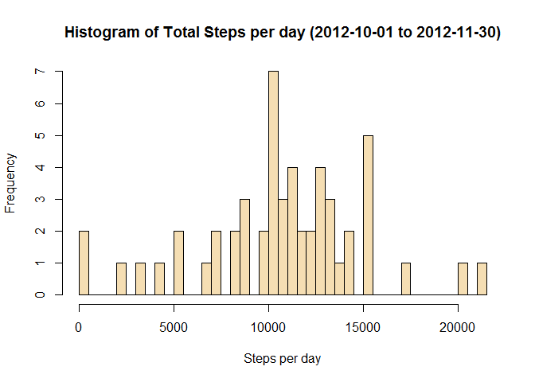
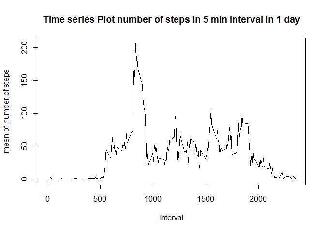
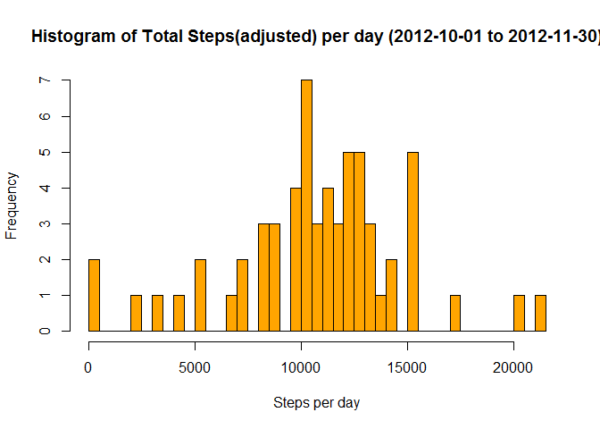
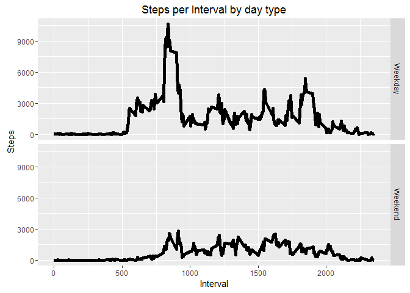

# Reproducible Research: Peer Assessment 1

This file includes the R script and resulting outputs for the 
Reproducible Rearch Week1 assignment. 

## Loading and preprocessing the data

```r
activity<-read.csv("activity/activity.csv")
library(dplyr)
```

```
## Warning: package 'dplyr' was built under R version 3.2.4
```

```
## 
## Attaching package: 'dplyr'
```

```
## The following objects are masked from 'package:stats':
## 
##     filter, lag
```

```
## The following objects are masked from 'package:base':
## 
##     intersect, setdiff, setequal, union
```

```r
library(ggplot2)
```

```
## Warning: package 'ggplot2' was built under R version 3.2.4
```


## What is mean total number of steps taken per day?

```r
### sum total steps group by day
dailyTotal <- activity %>%
     group_by(date) %>%
     summarize(daily_steps=sum(steps))
hist(dailyTotal$daily_steps, breaks = 50, xlab = "Steps per day", main = "Histogram of Total Steps per day (2012-10-01 to 2012-11-30)", col="wheat")
```



```r
meanstep<-mean(dailyTotal$daily_steps,na.rm = TRUE)
medianstep<-median(dailyTotal$daily_steps, na.rm = TRUE)
```
The mean of total number of steps taken per day is **1.0766189\times 10^{4}**.
The median of total number of steps taken per day is **10765**.


## What is the average daily activity pattern?


```r
intervalMean <- activity %>%
     group_by(interval) %>%
     summarize(mean1=mean(steps,na.rm=TRUE))

plot(intervalMean$interval,intervalMean$mean1, xlab="Interval", ylab="mean of number of steps", main="Time series Plot number of steps in 5 min interval in 1 day",type='l')
```



```r
maxstep <- max(intervalMean$mean1)
interval <- intervalMean[intervalMean$mean1==maxstep,]$interval
```
On average across all the days in the dataset, interval **835**
contains the maximum number of step of **206.1698113**


## Imputing missing values

check how many rows missing values in original data

```r
missValue<-is.na(activity$steps)
smv<-sum(missValue)
```
There are **2304** rows missing value.

check how many days has missing values after take sum of the 
daily intervals.


```r
missingDaily<-is.na(dailyTotal$daily_steps)
smd<-sum(missingDaily)
```
There are **8** days has missing values. 
**2304** divid **8** equals 24 hours * 60 min / 5 min, 288
intervals daily. 
Let us check all the days with missing values indeed has no intervals with values.


```r
### select the days with missing values into a vector
missingDay<-dailyTotal[is.na(dailyTotal$daily_steps),]$date
### check is.na for each interval with each day in the missing 
### day vector 
missingDayCheck<-is.na(activity[activity$date %in% missingDay,]$steps)
sumcheck<-sum(missingDayCheck)
```
The result is **2304**. So the number matches. We should replace 
the 8 days with missing values with other similar days. 
( same week day )


```r
### transform date to Date type
activity$date<-as.Date(activity$date)
### add weekday column to the data set
activity$weekday <- factor(weekdays(activity$date), levels=c("Monday", "Tuesday", "Wednesday","Thursday", "Friday", "Saturday","Sunday"))

### compute mean for each interval for each week day
weekdayIntervalMean <- activity %>%
     group_by(weekday,interval) %>%
     summarize(mean1=mean(steps,na.rm=TRUE))

### expand the weekday mean to cover number of weeks 
wim<- rep(weekdayIntervalMean$mean1,9)
### cut the weekday mean vector to match the days of experiment
wim<-wim[1:17568]
### replace missing values with weekday interval mean
activity$steps[missValue]<-wim[missValue]
```
Now We re-plot the histogram


```r
### re-calculate the daily total
dailyTotal2 <- activity %>%
     group_by(date) %>%
     summarize(daily_steps=sum(steps))
### plot the histogram
hist(dailyTotal2$daily_steps, breaks = 50, xlab = "Steps per day", main = "Histogram of Total Steps(adjusted) per day (2012-10-01 to 2012-11-30)", col="orange")
```



```r
meanstep2<-round(mean(dailyTotal2$daily_steps,na.rm = TRUE))
medianstep2<-round(median(dailyTotal2$daily_steps,na.rm = TRUE))
```
The mean of total number of steps taken per day is 
**1.0821\times 10^{4}**.

The median of total number of steps taken per day is 
**1.1015\times 10^{4}**.

The are both different than previous values


## Are there differences in activity patterns between weekdays and weekends?


```r
weekEnd <- c("Saturday", "Sunday")
activity2<-activity
activity2<-mutate(activity2, isWeekEnd=factor(weekday %in% weekEnd))
activity2$isWeekEnd<-factor(activity2$isWeekEnd,labels = c("Weekday","Weekend"))
dailyTypeMean <- activity2 %>%
    group_by(isWeekEnd,interval) %>%
    summarize(dailyMean=sum(steps))

ggplot(dailyTypeMean, aes(interval, dailyMean)) + geom_line(size=2) + facet_grid(isWeekEnd ~ .) +
    labs(x="Interval", y="Steps", title="Steps per Interval by day type")
```



**There are certainly more activities in weekdays.**
